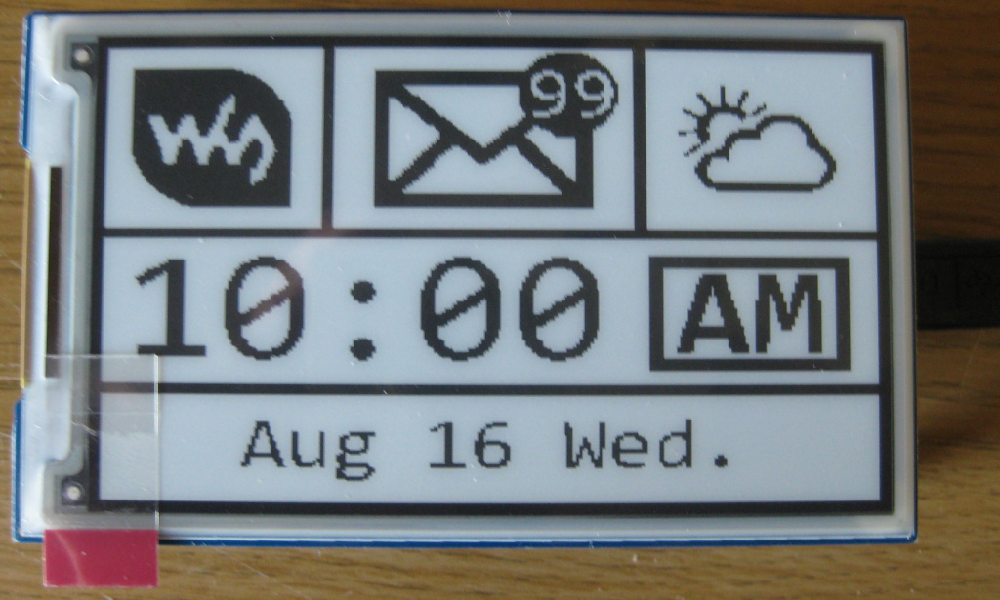

# Waveshare 3.7" e-ink for Pi Pico

This repository contains a very basic Arduino project to drive a
[Waveshare 3.7" e-paper Pi Pico display](https://www.waveshare.com/pico-epaper-3.7.htm)
from a Pi Pico, using the
[Arduino MBed core for Pi Pico](https://blog.arduino.cc/2021/04/27/arduino-mbed-core-for-rp2040-boards/).

The code in the repository is derived from the
[Waveshare example code](https://github.com/waveshare/e-Paper/tree/master/Arduino/epd3in7). Out of the
box, that code does **not work** on the Pi Pico, as the SPI assignments are not correct. I don't know
which hardware that code is for by default, but it needs modifications for the Pi Pico combination.

## SPI setup

Studying the [display schematics](https://www.waveshare.com/wiki/Pico-ePaper-3.7#Document), we find
that the display is connected to the SPI1 bus on the Pico. This is in a way unfortunate, as the default
Arduino SPI is SPI0, and normally there is no standard way to select SPI1 on an Arduino. However,
after some research, there is a method to invoke an arduino SPI block onto SPI1 in the Pico Mbed
system. We will use that with some minor code tweaks to get the display and code to work.

If you want the details, have a look in the `epdif.*` files for the changes. We setup and use an
`SPI1` object, and define the correct pins for the Pico display.

## Results

It works! When run you will see the e-paper display draw an image like below. It will then blank the
display - **don't panic** - that is by design in the code. I didn't change it as that is the way
the code comes.

Fingers crossed somebody finds this helpful!
